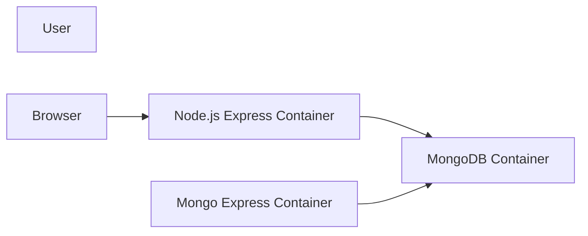
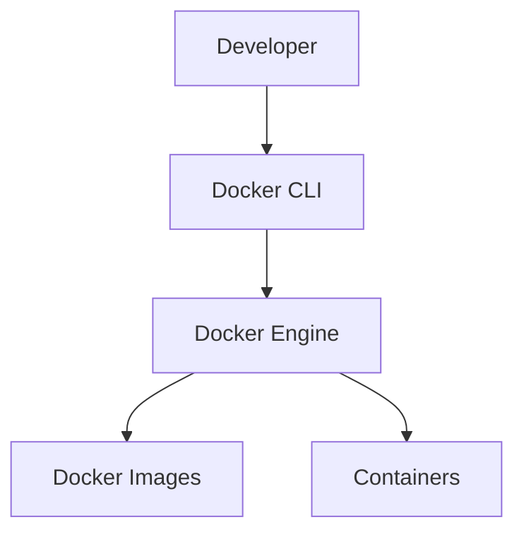
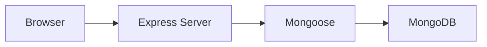
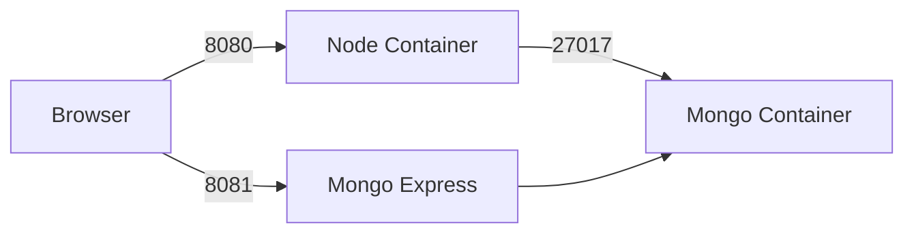
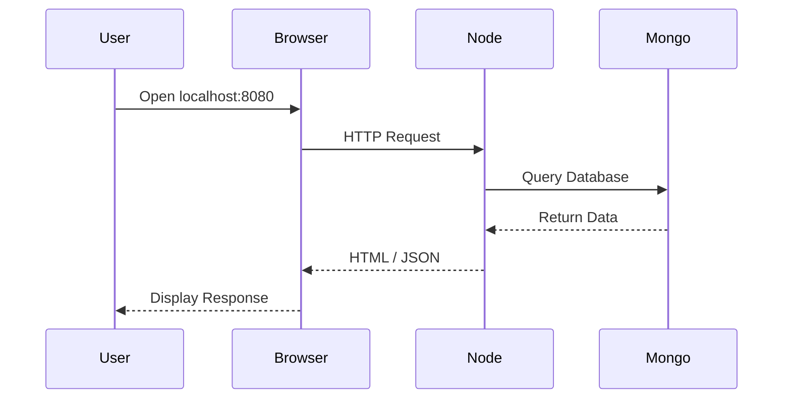
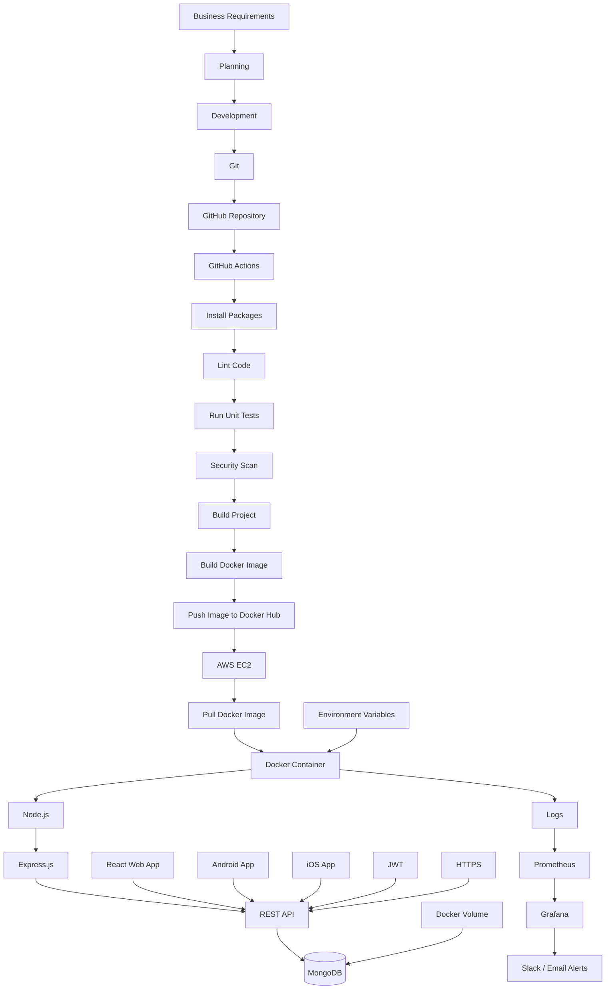

# 🐳 Dockerized Node.js + MongoDB Application

> A complete Dockerized Node.js application using Express.js, MongoDB, and Mongo Express.

---

# 🐳 What is Docker?

Docker is an open-source containerization platform that allows developers to package applications along with all their dependencies into lightweight, portable containers.

A Docker container includes:

- Application Code
- Runtime
- Libraries
- Packages
- Dependencies
- Environment Variables
- Configuration Files

This ensures the application behaves the same on every machine.

---

# 🚀 Why Docker Was Created

Docker was created to eliminate software deployment problems.

It allows developers to package an application with everything required to run it.

That package is called a **Container**.

Now the application runs identically on:

- Windows
- Linux
- macOS
- Cloud Servers
- AWS
- Azure
- Google Cloud

without changing any code.

---

# 🌍 Where Docker is Used

Docker is widely used in:

- Software Development
- Web Applications
- Microservices
- Cloud Computing
- DevOps
- CI/CD Pipelines
- Machine Learning
- Data Science
- AI Applications
- Enterprise Systems
- Kubernetes Deployments

---

# 📖 Project Overview

This project demonstrates how to containerize a Node.js application using Docker.

The application performs CRUD operations with MongoDB and provides a web interface using Mongo Express to visualize database records.

Instead of installing Node.js, MongoDB, and dependencies directly on the operating system, everything runs inside isolated Docker containers.

The application consists of three services:

- Node.js Express Application
- MongoDB Database
- Mongo Express Database UI

All services communicate through a custom Docker Bridge Network.

---

# 🛠 Technology Stack

| Technology | Purpose |
|------------|----------|
| Node.js | JavaScript Runtime |
| Express.js | Backend Framework |
| MongoDB | NoSQL Database |
| Mongoose | MongoDB ODM |
| Docker | Containerization |
| Mongo Express | MongoDB UI |
| Docker Network | Container Communication |

---

# 🏗 High-Level Architecture



---

# 🧱 Docker Architecture



---

# 🏛 Application Architecture



---

# 🌐 Complete Container Architecture



---

# 🔄 Request Flow



---

# 🧩 Docker Components Used

| Component | Purpose |
|------------|----------|
| Docker Engine | Runs Containers |
| Docker CLI | Executes Commands |
| Docker Image | Blueprint |
| Docker Container | Running Application |
| Docker Network | Communication |
| MongoDB | Database |
| Mongo Express | Database GUI |

---

# 📋 Prerequisites

Install:

- Docker Desktop
- Git
- VS Code

Verify Installation

```bash
docker --version
```

```bash
docker ps
```

```bash
docker images
```

---

# 🚀 Build Docker Image

```bash
docker build -t dockerization .
```

---

# ▶ Run MongoDB

```bash
docker run -d \
--name mongo \
--network mynetwork \
-p 27017:27017 \
mongo

OR

docker start mongo
```

---

# ▶ Run Node.js

```bash
docker run -d \
--name nodeapp \
--network mynetwork \
-p 8080:3000 \
-e MONGO_URL=mongodb://mongo:27017/mydatabase \
dockerization

OR
docker ps
docker start nodeapp
```

---

# ▶ Run Mongo Express

```bash
docker run -d \
--name mongo-express \
--network mynetwork \
-p 8081:8081 \
-e ME_CONFIG_MONGODB_SERVER=mongo \
-e ME_CONFIG_BASICAUTH_USERNAME=admin \
-e ME_CONFIG_BASICAUTH_PASSWORD=admin123 \
mongo-express

OR

docker start mongo-express
```

---

# 🎉 Application URLs

| Service | URL |
|----------|-----|
| Node.js | http://localhost:8080 |
| Users API | http://localhost:8080/users |
| Add User | http://localhost:8080/add-user |
| Mongo Express | http://localhost:8081 |

---


